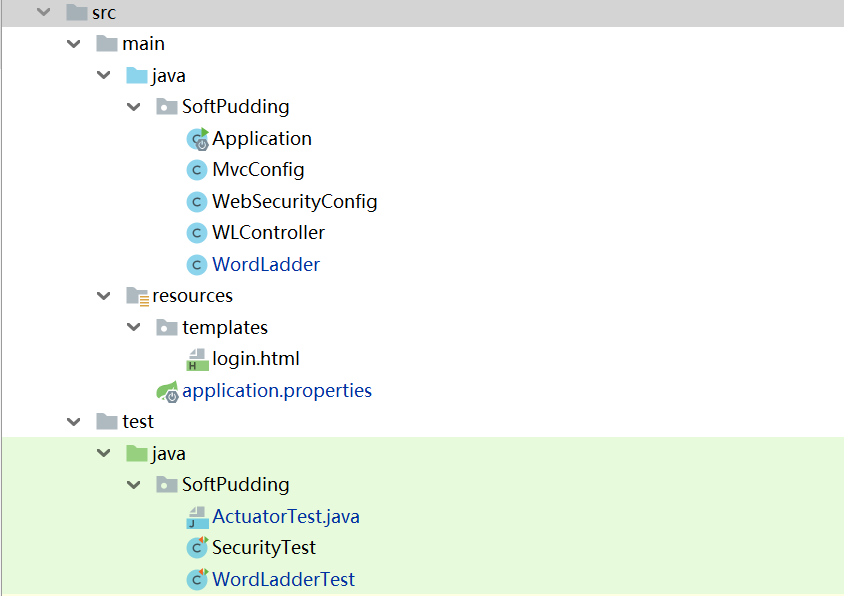
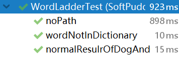
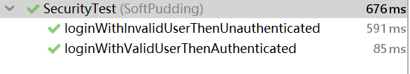

# README
## 测试用账户:
用户名：user
密码：password
## 测试用服务器：
word ladder api:
106.12.89.107:9000/wl/search?w1=[WORD1]&w2=[WORD2]
spring-boot actuator:
106.12.89.107:9001/actuator/health
## 本地项目结构：

## 本地运行api
<b>请使用浏览器，因为我的login是写了一个html</b>

localhost:9000/wl/search?w1=[WORD1]&w2=[WORD2]
spring-boot actuator:
localhost:9001/actuator/health
## UNIT TEST
unit test有三个部分，分别测试word ladder,actuator以及security。
其中
#### WordLadderTest
测试了三种情况：最普通的dog->cat的情况，测试单词不在字典中的情况，找不到路径的情况。

#### SecurityTest
测试了用合法的用户名密码以及不合法的用户名密码进行授权。

#### ActuatorTest
测试了相应端口是否开放。
