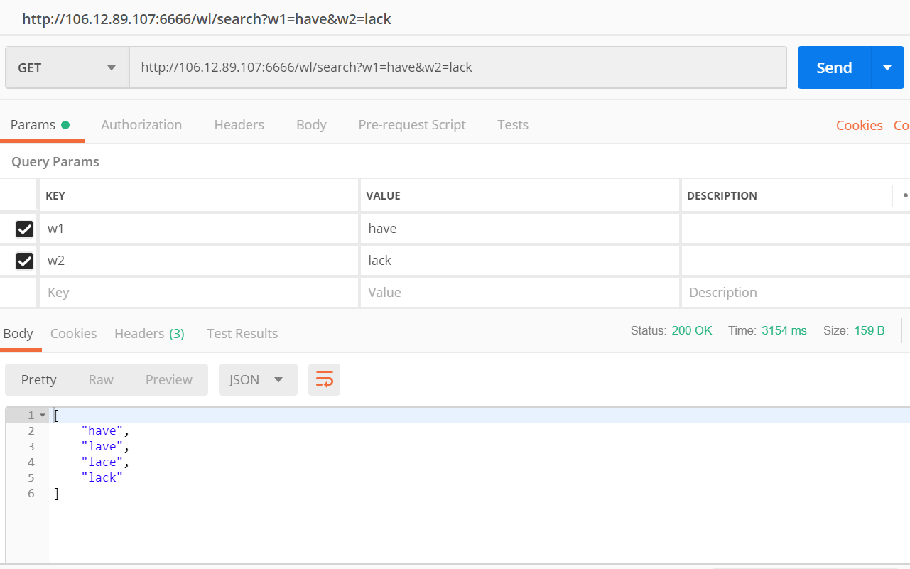

# README
## 这是一个mvn project。
## 方案1
您可以选择不运行我的project，直接在我的服务器上实验。相应的地址是
http://106.12.89.107:6666/wl/search?w1=?1&w2=?2
其中请用自己想查询的单词替换?1 和 ?2
例如：
http://106.12.89.107:6666/wl/search?w1=have&w2=lack
结果显示：

## 方案2
您可以用maven引入我的project。xml文件就在hw2目录下。
然后输入mvnw spring-boot:run，您可以在本地的6666端口下进行测试。
