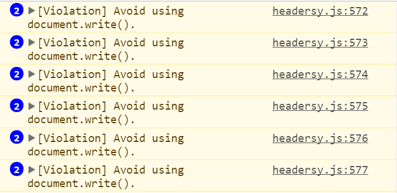
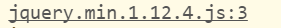
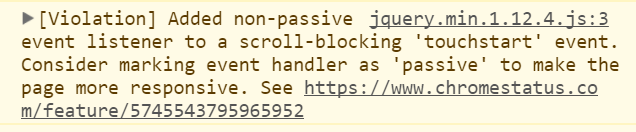
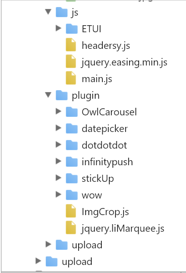
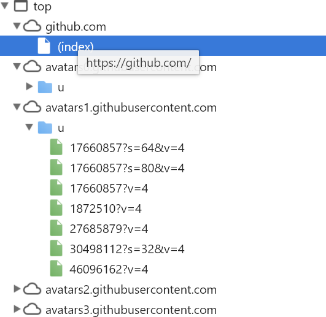

# <b>TASK 1</b>
## <b>测试环境:Chrome</b>
## loading过程
1. 打开console可以看到，SJTU的首页的js文件中含有巨量的Document.write()方法。
    
chrome在之前就已经宣布会禁止Document.write()方法的使用。Document.write()会导致巨量性能的损耗。

2. 从部分报错信息可以看到SJTU首页用的框架是Jquery。
    
3. console同时有关于"Added non-passive event listener"的提示，大概有接近十条。Chrome的官方解释是使用Passive Event Listener可以"dramatically improve scrolling performance"。
    
4. 有由Chrome 56带来的feature导致的[Violation]。说明该应用需要优化。
5. 打开element界面可以看到\<script\>中的代码都是暴露的。可以直接看到很多Javascript的代码。
6. Source里所有文件基本都暴露。
    

## 与github主页比较
1. github主页没有任何的warning或者violation。
2. element界面只能看见html文件，DOM元素。
3. Source里也没有任何源代码暴露。
    

## 我的优化方案
1. 改用更新的框架(比如Vue)。拒绝使用Doument.write()函数，直接使用Vue的方法去操作DOM。
2. 关闭web容器的目录浏览功能。不要直接暴露源文件。
3. 对网站中不同内容进行模块化测试，提高网页加载效率。

## <b>Reference</b>
[为什么要避免使用document.write](https://www.zcfy.cc/article/why-you-should-avoid-using-document-write-specifically-for-scripts-injection-1464.html)

[Passive Event Listener](https://www.chromestatus.com/feature/5745543795965952)

[Violation Long running JavaScript task took xx ms
](https://stackoverflow.com/questions/41218507/violation-long-running-javascript-task-took-xx-ms)

