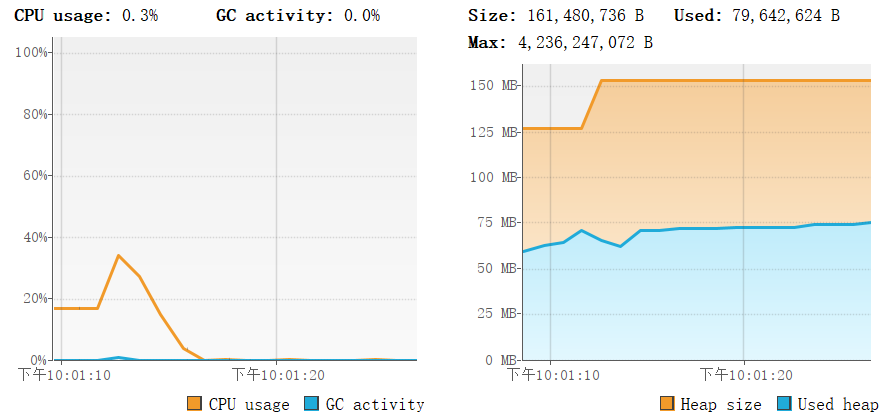
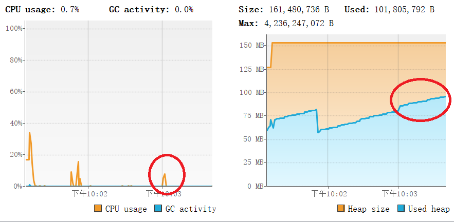
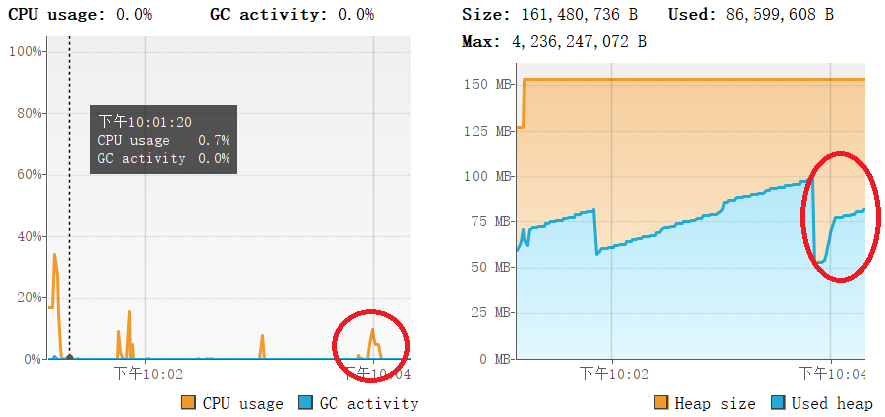
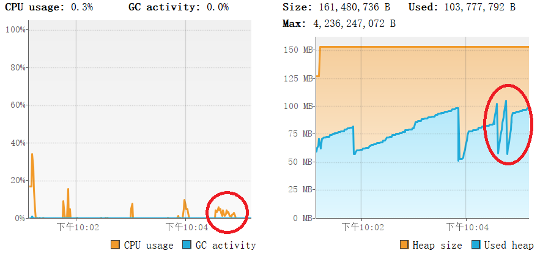
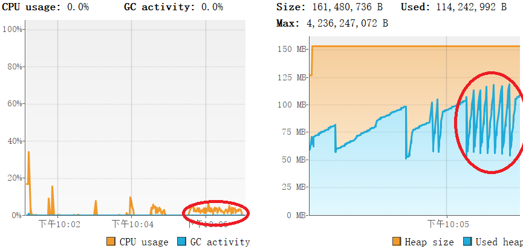
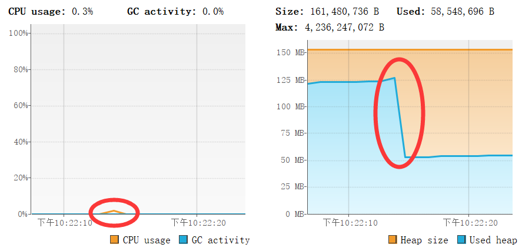
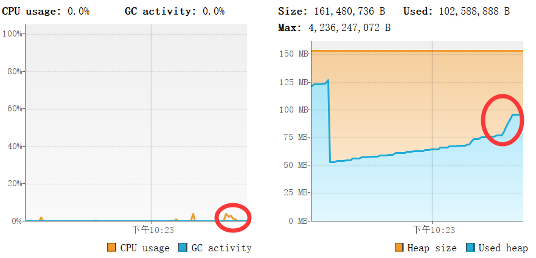
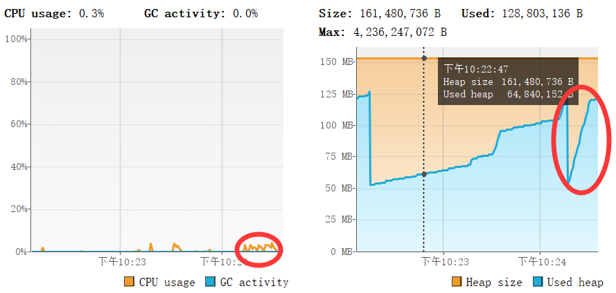
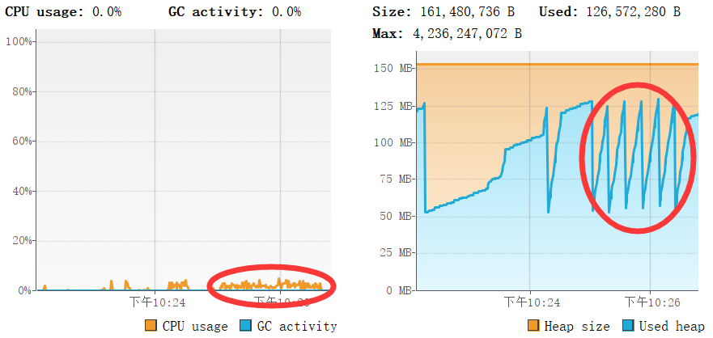

# WORDLADDER 分析
## 测试1
<b>这个测试是测试了比较简单的从cat-->dog的这种路径，测试了0、50、200、1000、4000次连续请求会产生的内存/cpu情况.</b>
#### 0次请求

#### 50次请求

红色圈是我认为由当前调用引起的cpu/内存变化。
#### 200次请求

可以看到，和50次相比，200次的cpu峰值更高。而且在50次请求完后内存从一个高值落到了一个很低的地方，但是在200次请求开始时又再次变高。这很明显是得益于tomcat或者Java垃圾回收机制对于内存的处理。
#### 1000次请求

1000次请求的cpu相对于前几次而言是时间边长了，但是强度并没有进一步提高。
二内存出现了波折的情况。
#### 4000次请求

cpu的趋势和之前相同，不过峰值好像进一步降低了，cpu活跃的时间先行增长。内存的波动加剧了。这应该就是一种垃圾回收机制，避免jvm占用内存过多。
## 测试2
<b>这个测试是从application到collection的情况。在wordladder中这个程序会遍历所有可能最后给出一个否定的解答，所以相对于前一个测试用例这个运行耗费应该更高。</b>
#### 50次请求

运行期间堆首先变得很小，不知道为什么。
#### 200次请求

和上一个test1规律一直：cpu峰值不变，内存变高。
#### 1000次请求

这一次也是，cpu时间线性增长，堆首先变得很小然后在增长。
#### 5000次请求

cpu时间线性增长，峰值不变。内存开始出现周期性的波动。

